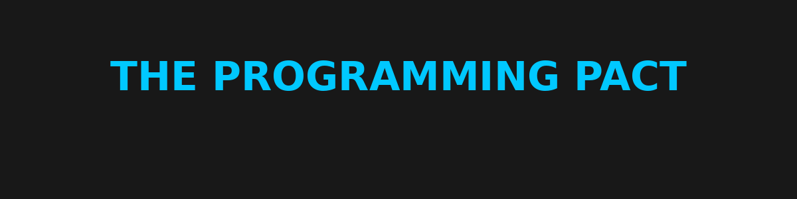

# 

> **"Code is our weapon. Freedom is our mission. Brotherhood is the protocol."**

Welcome to the **Programming Pact HQ** — a digital stronghold forged by Ethan, Chandler, and Jimmy.  
Here we build bots, bend code, freelance for cash, and train for the cyber frontline.

---

## Pact Members

| Name      | Role                  | Focus                    |
|-----------|-----------------------|---------------------------|
| Ethan     | Founder & Architect   | Python, Automation, Security |
| Chandler  | Co-Dev & Ops Strategist | Backend, Tools, CLI |
| Jimmy     | Co-Dev & Game Engineer | C/C++, Games, AI |
| ???       | [Redacted]            | Initiate in waiting...     |

---

## Pact Rules

1. **Show up** — Progress beats perfection.
2. **Log your work** — No ghost coding. Push it or write it down.
3. **One mission at a time** — Focus, complete, level up.
4. **We move as a team** — No one left behind.

---

## Workflow Overview

### Main Branch: `/main`

The living codebase. All approved tools and bots live here.

### Dev Branches: `/dev-ethan`, `/dev-chandler`, `/dev-jimmy`

Individual workstations for experimenting, building, and testing.

---

## Projects Under Construction

- [ ] Auto File Organizer (Python)
- [ ] YouTube Video Downloader (Python)
- [ ] Craigslist Scraper
- [ ] TryHackMe Learning Logs
- [ ] Bot Deployment Templates
- [ ] Portfolio Projects (Freelance-ready)

---

## 📁 Behind the Code: Essential Tools & Docs

Check the `Behind-the-Code/` folder for all internal tools, guides, and cheat sheets:

- `openai_model_cheat_sheet.html` – Model usage cheat sheet for o1, o3, o4-mini
- `notion_automation_training_doc.html` – Full Notion automation onboarding
- `Prompt engineering best practices for ChatGPT _ OpenAI Help Center.pdf` – Prompting techniques
- `onboarding_instructions.html` – Start here if you're new (Jimmy, Chan)

These files can be opened locally or hosted. All members should read these.

---

## 🛠️ Contributing

This project uses a multi-branch workflow. Each member has their own dev branch to work freely:

- `dev-ethan` – automation, backend, and tools
- `dev-chandler` – CLI tools, scripts, and backend
- `dev-jimmy` – game experiments and learning projects

Before contributing, please read the [CONTRIBUTING.md](./CONTRIBUTING.md) for guidelines.

---

## Resources & Learning Tracks

- [Python Course (YouTube)](https://www.youtube.com/watch?v=rfscVS0vtbw)
- [TryHackMe Pre-Security Path](https://tryhackme.com/path/outline/presecurity)
- [Hack The Box Academy](https://academy.hackthebox.com)
- [VS Code Download](https://code.visualstudio.com)
- [GitHub Guide](https://guides.github.com/activities/hello-world/)

---

## Pact Motto

> _"Code hard. Stay human. Defy the default."_

---

**Let’s build something the system can’t ignore.**